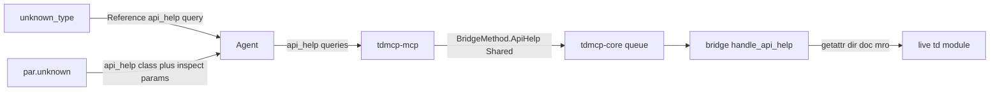

# Ship `api_help` (live TD Python API cards)

## Locked decisions

| Fork | Choice |
|------|--------|
| Name | Keep **`api_help`** (finish CONTRACT Planned row — not a second tool) |
| Mental model | **Structured API cards + names index** — not “fetch a documentation page.” No `helpText` / wiki body in v1. |
| Truth | **Live only** via bridge: `getattr(td,name)`, `dir`, `__doc__`, class `opType`/`family`/`mro`. **Never** dump raw `help()` (~42KB/class). No bundled static OP corpus in td-mcp-rs. |
| Curated knowledge | **Keep** creative-corpus family/cheatsheets for conceptual “when to reach for X.” Operator **parameter** prose stays wiki/corpus; live param **names** via `inspect` include params. |
| `pid` | **Always required** — Shared queue, call-timeout budget. |
| vs `describe_tools` | **Hard split** — TD Python / OP types only. |
| Dynamic refs | **`tdmcp.op.unknown_type`** + **`tdmcp.par.unknown`** (class/opType query only); similar_* keep `suggestion.replace` + optional `api_help` on suggested name; `flag.unknown` / `script.*` / `td.glsl_compile` unchanged. |
| Params listing | **Out of `api_help` v1** — class `.par` is `getset_descriptor` with empty `dir`. Use `inspect` include params (or similar_name). No ephemeral create/destroy. |

## Live verification (pid 28744, TD build 2025.32460)

Probed 2026-08-03 via `user-tdmcp-rs` `execute_python` (reference MCP on :9981 was down — schemas only).

| Claim | Live result | Plan consequence |
|-------|-------------|------------------|
| `td` introspectable | 807 public; 774 types; **~687** op-like; 33 non-types | `classes` = op-like names (`_is_op_type_name`); optional `family` / `prefix` filters |
| Op class is `type` | `td.noiseTOP`, MRO `noiseTOP→TOP→OP`, short `__doc__` | `kind: class` via `getattr(td, name)` |
| Case sensitivity | `hsvadjustTOP` yes, `hsvAdjustTOP` no | Exact query; matches `similar_type` |
| Class identity w/o instance | `cls.opType` / `family` work on the class | Echo on cards; no create for identity |
| Class `.par` listing | `getset_descriptor`, `dir` = `[]` | Cannot list `.par.*` from class |
| Instance pars | create → 51 names → destroy | `inspect` only — not `api_help` |
| Raw `help(cls)` | ~42KB / 925 lines; inherited TOP/OP; unreliable for param names | **Out of contract** — no help field |
| Payload sizes | summary card ~0.8KB; detailed ~2.4KB; full classes list ~10KB; 32×help ≈ 1.3MB | Cards + index yes; help dumps no |
| Wiki split | [NoiseTOP_Class](https://docs.derivative.ca/NoiseTOP_Class) (no OP-specific members); params on [Noise_TOP](https://docs.derivative.ca/Noise_TOP) | Optional `wikiUrl` pointer only (first-letter-upper + `_Class`; `GlslTOP_Class` OK, `GLSLTOP_Class` 404) |
| Operate flags | all 8 on class | `flag.unknown` = allowlist mitigation |
| `inspect.signature` | fails on builtin TD types | Do not use |
| `execute_python` globals | only `td` + `op` | Handler uses `td.*` |
| `td.families` | COMP/TOP/CHOP/SOP/POP/MAT/DAT | Informs `family` filter enum |

**Catalog accuracy fix:** `tdmcp.par.unknown` must not claim `api_help` lists parameters — class lookup + `inspect` params / `similar_name`.

## Wire contract

**Params** (inspect-style batching):

```json
{
  "pid": 12345,
  "queries": [
    { "kind": "class", "name": "noiseTOP" },
    { "kind": "classes", "family": "TOP", "prefix": "noise" },
    { "kind": "module", "name": "td" }
  ],
  "detailLevel": "summary",
  "diagnosticLevel": "summary"
}
```

| Field | Rule |
|-------|------|
| `pid` | Required |
| `queries` | Required, non-empty; soft-cap **32**/call + truncation metadata |
| `queries[].kind` | `class` (primary) \| `classes` (index) \| `module` (thin parity) |
| `queries[].name` | Required for `class` / `module` |
| `queries[].family` | Optional on `classes` — TOP/CHOP/SOP/DAT/MAT/COMP/POP |
| `queries[].prefix` | Optional on `classes` — casefold prefix |
| `detailLevel` | Caps **member list** / whether `wikiUrl`+full `mro` appear — **not** help prose (no help field) |
| `diagnosticLevel` | Default `summary` |

**Result** — API card / index, not a page:

```json
{
  "ok": true,
  "results": [
    {
      "ok": true,
      "kind": "class",
      "name": "noiseTOP",
      "doc": "This class inherits from the TOP class.\nIt references a specific Noise TOP.",
      "opType": "noiseTOP",
      "family": "TOP",
      "mro": ["noiseTOP", "TOP", "OP", "object"],
      "members": ["cook", "par", "pars", "path"],
      "memberCount": 163,
      "wikiUrl": "https://docs.derivative.ca/NoiseTOP_Class"
    },
    {
      "ok": true,
      "kind": "classes",
      "names": ["noiseTOP"],
      "count": 1,
      "family": "TOP",
      "prefix": "noise"
    }
  ],
  "queriesTruncated": false
}
```

- Per-entry partial success (`ok:false` + `tdmcp.api_help.not_found` / optional `failed`).
- **No `helpText` / wiki body** in v1.
- `summary`: short doc, identity, ~40 members, `memberCount`; may omit `wikiUrl`.
- `detailed`: full public member **names** (or higher cap), full `mro`, include `wikiUrl`. No per-member docstrings.
- Unfiltered `classes` ≈ 10KB / ~687 names — OK; soft safety cap + `truncation` still. Prefer `family`/`prefix` for typo recovery.
- `module`: `{ doc, publicCount, typeCount, sample }` — capped.
- Timeout **call** 45s; `TaskMode::Shared`; read-only (no create/destroy).

**Diagnostic `Reference`:** `{ "kind": "api_help", "query": "noiseTOP" }` → `{ kind: "class", name: query }`. `par.unknown` also steers to `inspect` include params.



## Phase A — Tool surface (td-mcp-rs) — exit green

Ship callable `api_help` end-to-end without dynamic diagnostics yet.

**Rust**
- [`crates/tdmcp-core/src/bridge_method.rs`](crates/tdmcp-core/src/bridge_method.rs): `ApiHelp` (`api_help` / `ApiHelp`); `ALL` / `from_wire`.
- [`bridge/fixtures/bridge_methods.json`](bridge/fixtures/bridge_methods.json) + parity tests.
- [`crates/tdmcp-mcp/src/tools.rs`](crates/tdmcp-mcp/src/tools.rs): `ApiHelpParams` with query kinds + `family`/`prefix`; descriptor; `dispatch_tool` → Shared `BridgeMethod::ApiHelp`.
- [`crates/tdmcp-mcp/src/schema.rs`](crates/tdmcp-mcp/src/schema.rs) + [`schema_golden.rs`](crates/tdmcp-mcp/tests/schema_golden.rs).
- Daemon call-timeout default arm (not script budget).
- Thin outcomes mapper: `{ ok, results, … }` / soft-fail flatten like inspect.

**Bridge Python**
- [`bridge/tdmcp_bridge/__init__.py`](bridge/tdmcp_bridge/__init__.py): method + `handle_api_help` + HANDLERS.
- Cards only: `getattr(td,…)`; `classes` via `_is_op_type_name` + filters; `class` = doc/opType/family/mro/capped members/`memberCount`/optional `wikiUrl`; `module` thin; **never** `help()` capture or `create`.
- Pytest: kinds, filters, not-found, truncation, no-create / no-help assertions.

**Integration:** FakeTdPeer `api_help` round-trip + partial entry failure ([`bridge_session.rs`](crates/tdmcp-daemon/tests/bridge_session.rs) or sibling).

**Versioning:** Additive method; bump extract stamp; `protocolVersion` stays `"1"`; no offline fallback.

**Docs:** [`docs/CONTRACT.md`](docs/CONTRACT.md) catalogue → **Shipped** with API-card spec (explicit: no help dumps; params → inspect); [`docs/TESTING.md`](docs/TESTING.md) bullet; no [`TODOLIST.md`](TODOLIST.md) entry.

**Exit green A:** workspace + bridge tests green; schema golden; FakeTdPeer OK; CONTRACT documents cards + param-routing split.

## Phase B — Dynamic diagnostic references — exit green

**Catalog** ([`diagnostics/catalog.yaml`](diagnostics/catalog.yaml)):
- `tdmcp.op.unknown_type` → `kind: api_help`; mitigation: `api_help` class query (case-sensitive); optional `classes` + prefix for exploration.
- `tdmcp.par.unknown` → `kind: api_help` (node opType) + mitigation: **`inspect` include params** / `suggestion.replace` — do not claim param listing via `api_help`.
- `script.*` / `td.glsl_compile` stay corpus; `flag.unknown` allowlist only.

**Outcomes** ([`map_mutate_outcome`](crates/tdmcp-mcp/src/outcomes.rs)): splice `Reference{kind:api_help, query}` after `build_diag` (do not grow `Catalog::build_error` yet).

| Code | query |
|------|-------|
| `unknown_type` | `span.field` |
| `par.unknown` | echoed step `opType` (not the bad param) |
| similar_* | also query = `suggestion.replace` when present |

Bridge echoes `opType` on failed set / unknown_type steps. Unit tests in `outcomes.rs`.

**Exit green B:** fixtures show dynamic query; mitigations match live capability; catalog completeness green.

## Phase C — creative-corpus skill routing — exit green

Repo: [`creative-corpus`](C:\Users\corbe\Documents\Derivative\Projects\creative-corpus).

- [`skills/ccorp-tdmcp-rs/SKILL.md`](C:\Users\corbe\Documents\Derivative\Projects\creative-corpus\skills\ccorp-tdmcp-rs\SKILL.md): tool row + routing:
  - opType / Python members → `api_help` (cards; `classes` + `family`/`prefix` for search)
  - parameter names on existing node → `inspect` include params
  - conceptual family / when-to-use → **ccorp-touchdesigner** (kept)
- [`reference/examples.md`](C:\Users\corbe\Documents\Derivative\Projects\creative-corpus\skills\ccorp-tdmcp-rs\reference\examples.md): class card + filtered `classes` example; diagnostics follow-up.
- [`operator-families.md`](C:\Users\corbe\Documents\Derivative\Projects\creative-corpus\skills\ccorp-touchdesigner\reference\operator-families.md) / [`python-api.md`](C:\Users\corbe\Documents\Derivative\Projects\creative-corpus\skills\ccorp-touchdesigner\reference\python-api.md): keep cheatsheets; one deferral to live `api_help` for exact names.

**Exit green C:** no competing lookup answers; class vs param vs conceptual split explicit.

## File map

**td-mcp-rs:** `bridge_method.rs`, `bridge_methods.json`, `tools.rs`, `schema.rs`, `schema_golden.rs`, `outcomes.rs`, `codes.rs`, `catalog.yaml`, `__init__.py`, `bridge/tests/*`, daemon integration test, `CONTRACT.md`, `TESTING.md`.

**creative-corpus:** `skills/ccorp-tdmcp-rs/SKILL.md`, `reference/examples.md`, light touch on `ccorp-touchdesigner/reference/*.md`.

## Out of scope

- Offline / pid-less doc cache
- Bundled OP parameter corpus in td-mcp-rs
- Ephemeral create/destroy to scrape `pars()` inside `api_help`
- Raw `help()` / wiki HTML / per-member docstring dumps
- Folding MCP tool docs into `api_help`
- Dynamic api_help on GLSL / script failures
- Guaranteed wiki HTTP (best-effort `wikiUrl` string only)
- `dialogs` / lifecycle / TODOLIST blacklist-FPS items
