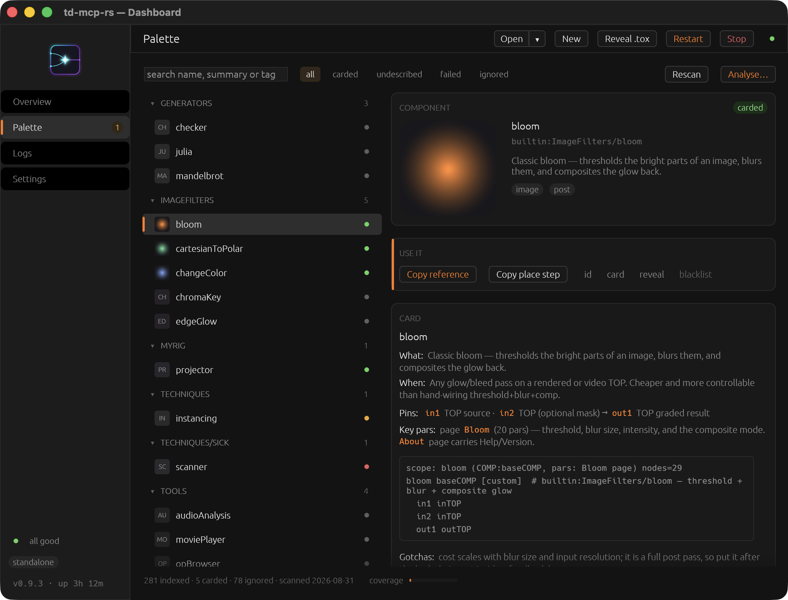

<div align="center">


# td-mcp-rs

### Give your AI assistant hands inside TouchDesigner.

**It sees your network. It builds and wires nodes. It runs your project,
looks at the render, and fixes what it got wrong — on your machine, across
your whole studio, with whatever assistant you already use.**

[](LICENSE)
[](CHANGELOG.md)
[](#step-1--install-the-daemon)
[](https://buymeacoffee.com/asyade)

<table>
  <tr>
    <td width="50%" align="center"><br><sub><b>Overview</b> · fleet, clients and activity across machines</sub></td>
    <td width="50%" align="center"><br><sub><b>Palette</b> · your components, with agent-ready reference cards</sub></td>
  </tr>
  <tr>
    <td width="50%" align="center"><br><sub><b>Logs</b> · filter, search, follow or pause</sub></td>
    <td width="50%" align="center"><br><sub><b>Settings</b> · every knob, honest save gating</sub></td>
  </tr>
</table>

**[Quick start](#quick-start) · [What you can ask for](#what-you-can-actually-ask-for) · [Federation](#federation--one-agent-many-machines) · [The toolbox](#the-toolbox) · [Full install guide](docs/INSTALL.md)**

</div>

---

## The problem

Ask any AI assistant about TouchDesigner and it will answer confidently — and
often wrongly. It has never seen your network. It cannot tell a Noise TOP from
a Null, cannot check whether the wire it suggested actually exists, and has no
idea your render is black. Every "help me fix this" turns into you narrating
your screen, pasting parameter values, and describing a picture.

**td-mcp-rs closes that loop.** A small tray app runs beside TouchDesigner and
gives your assistant a real, live connection into the running project: it can
look at any operator, create and wire nodes, drop in Palette components, run
Python, screenshot a TOP and *actually see the result*, then correct itself.

```text
   ┌───────────────────┐                        ┌────────────────────────┐
   │  Your assistant   │   MCP over localhost   │      td-mcp-rs         │
   │  Claude · Cursor  │ ─────────────────────► │   tray app + daemon    │
   │  Codex · Copilot  │ ◄───────────────────── │   (one small binary)   │
   └───────────────────┘    structured facts    └───────────┬────────────┘
                                                            │ local bridge
                                                            ▼
                                    ┌───────────────────────────────────────┐
                                    │      TouchDesigner  ·  your project   │
                                    │  inspect · build · wire · run · see   │
                                    └───────────────────────────────────────┘
```

Nothing leaves your machine. One binary, one drop-in `.tox`, one local
connection.

---

## Four things that make it different

### 1 · It works with the assistant you already have

There is no td-mcp-rs subscription, no account, no sign-in, no relay server,
and no "supported editor" list to wait on. It speaks **MCP**, the open protocol
every serious AI coding tool now supports — so Claude Code, Cursor, Codex CLI,
VS Code / Copilot, Windsurf, Zed, Cline and the rest all work out of the box,
today, with the same one-line setup. Your AI bill stays between you and whoever
you already pay. This project is MIT and free forever.

### 2 · It automates real work, not demos

It doesn't just edit one open file. It can **start TouchDesigner itself**,
open or create a project from your template, drive several instances at once
(every call is addressed by OS process id — no "current file" confusion), open
and edit `.toe`/`.tox` files *offline* through Derivative's own tools, inject
the bridge into an existing project, dismiss the modal dialog that would have
blocked everything, and shut it all down when it's done.

### 3 · It scales past one computer

Run td-mcp-rs on your render nodes, your media server, the machine in the
booth. Point one **master** at them and a single assistant addresses the whole
room: inspect a node on `studio-b`, capture the output on `studio-c`, push the
same fix to all three. This is the part nothing else does — see
[Federation](#federation--one-agent-many-machines).

### 4 · It actually understands TouchDesigner — and meets you where you are

The daemon ships a built-in **operate manual**: primers on cooking and operator
families, network design conventions, custom parameters, GLSL ground truth and
Shadertoy porting, a compact notation for sketching networks before building
them. Your assistant reads these on its own, so it stops improvising.

That knowledge scales down as easily as it scales up:

| You want to… | Say something like |
| --- | --- |
| **Learn** | *"What's actually happening in this feedback loop? Walk me through it."* |
| **Get unstuck** | *"This TOP is black — find out why."* |
| **Save keystrokes** | *"Add a Level TOP after `noise1`, drop gamma to 0.8, wire it to the Out."* |
| **Delegate a chunk** | *"Build me an audio-reactive particle system from the Palette, in a new COMP."* |
| **Delegate the lot** | *"Make a new project from my template, build a 3-scene VJ setup with a crossfader, and show me a screenshot of each scene."* |

Same tool, same session. Ask for a nudge or ask for the whole build.

---

## Quick start

Four steps, about five minutes. Windows and macOS.

### Step 1 · Install the daemon

**From a pre-built binary** — grab [v0.1.4 from the releases
page](https://github.com/Verbalize-public/td-mcp-rs/releases/latest):

| Platform | Download |
| --- | --- |
| macOS · Apple Silicon | `tdmcp-rs-0.1.4-aarch64-apple-darwin.dmg` |
| macOS · Intel | `tdmcp-rs-0.1.4-x86_64-apple-darwin.dmg` |
| Windows · x64 | `tdmcp-rs-0.1.4-x86_64-pc-windows-gnu.zip` |

Each download is one self-contained binary — no runtime, no DLLs, nothing else
to install. The one-click Windows installer (`.exe`) is arriving soon; until
then, the manual steps below take about a minute.

<details>
<summary><b>Manual install</b> — no Rust toolchain needed</summary>

**macOS (DMG)** — mount, copy, unblock, link:

```bash
hdiutil attach tdmcp-rs-0.1.4-*.dmg
cp -R /Volumes/td-mcp-rs*/tdmcp.app /Applications/
hdiutil detach /Volumes/td-mcp-rs*
xattr -cr /Applications/tdmcp.app    # unsigned build — clears the Gatekeeper block
sudo ln -sf /Applications/tdmcp.app/Contents/MacOS/tdmcp-daemon /usr/local/bin/tdmcp-daemon
```

**macOS (tar.gz)** — or skip the bundle and drop the bare binary on your `PATH`:

```bash
tar -xzf tdmcp-rs-0.1.4-*.tar.gz
sudo cp tdmcp-daemon /usr/local/bin/ && xattr -cr /usr/local/bin/tdmcp-daemon
```

**Windows (zip)** — expand somewhere stable and add it to `PATH`
(or just use the full path in the editor configs below):

```powershell
Expand-Archive tdmcp-rs-0.1.4-x86_64-pc-windows-gnu.zip -DestinationPath "$env:LOCALAPPDATA\Programs\tdmcp-rs"
& "$env:LOCALAPPDATA\Programs\tdmcp-rs\tdmcp-daemon.exe" install
```

</details>

Finish either path with one command — it unpacks the bridge + assets:

```bash
tdmcp-daemon install
```

> Builds are not code-signed yet (on the roadmap). macOS Gatekeeper blocks the
> first launch — `xattr -cr` or System Settings ▸ Privacy & Security clears it.
> Windows SmartScreen may show *"More info → Run anyway"*. Verify downloads
> against `SHA256SUMS.txt` on the release page.

**The from-source way** — needs [Rust](https://rustup.rs) (`rustup` installer,
then restart your terminal). This puts `tdmcp-daemon` on your `PATH`, which
makes every editor config below a single word:

```bash
git clone https://github.com/Verbalize-public/td-mcp-rs
cd td-mcp-rs
cargo install --path crates/tdmcp-daemon    # ~5 min, one time
tdmcp-daemon install                        # unpack assets + prepare the bridge
```

Start it once — `tdmcp-daemon start`, or launch **tdmcp** from your Start menu
/ Applications — and a tray icon appears. **Left-click** it for a glance card,
**double-click** for the dashboard. After that your editor starts it on its own
whenever it needs it.

### Step 2 · Connect your AI assistant

Everything below is the same one idea: tell your assistant to run
`tdmcp-daemon` with the argument `mcp`. Pick your tool:

<details open>
<summary><b>Claude Code</b> — two commands, includes the TouchDesigner skills</summary>

```text
/plugin marketplace add Verbalize-public/td-mcp-rs
/plugin install td-mcp-rs@td-mcp-rs
```

Claude Code asks once for the `tdmcp-daemon` binary path. If you installed
with `cargo install`, the default `tdmcp-daemon` is already correct — just
press enter. Otherwise paste the path from
[the install guide](docs/INSTALL.md#where-the-binary-lands).

This registers the MCP server **and** installs the TouchDesigner operate skill
pack, so Claude reaches for the right tool without being told.

</details>

<details>
<summary><b>Cursor</b></summary>

**Settings → Cursor Settings → MCP → Add new global MCP server**, then:

```json
{
  "mcpServers": {
    "tdmcp-rs": {
      "command": "tdmcp-daemon",
      "args": ["mcp"]
    }
  }
}
```

If `tdmcp-daemon` isn't on your `PATH`, replace `"tdmcp-daemon"` with the full
path to the binary — [see the table](docs/INSTALL.md#where-the-binary-lands).

</details>

<details>
<summary><b>VS Code + GitHub Copilot</b></summary>

Command Palette → **MCP: Add Server** → **Command (stdio)** → command
`tdmcp-daemon`, args `mcp`. Or write `.vscode/mcp.json` yourself:

```json
{
  "servers": {
    "tdmcp-rs": { "type": "stdio", "command": "tdmcp-daemon", "args": ["mcp"] }
  }
}
```

Then open Copilot Chat in **Agent** mode.

</details>

<details>
<summary><b>Codex CLI</b></summary>

Add to `~/.codex/config.toml`:

```toml
[mcp_servers.tdmcp-rs]
command = "tdmcp-daemon"
args = ["mcp"]
```

</details>

<details>
<summary><b>Windsurf · Zed · Claude Desktop · Cline · Roo · Continue · anything else</b></summary>

Same server, different file. Full per-tool walkthroughs with exact config
paths live in **[docs/INSTALL.md](docs/INSTALL.md#step-2--connect-your-assistant)**.

The universal shape, for any MCP client ever:

```json
{ "command": "tdmcp-daemon", "args": ["mcp"] }
```

There is nothing else to configure — no port, no token, no project path.
Anything that speaks MCP over stdio works.

</details>

### Step 3 · Drop the bridge into TouchDesigner

Open the dashboard and click **Reveal .tox**, or find the file yourself:

| Your OS | Path |
| --- | --- |
| Windows | `%LOCALAPPDATA%\tdmcp-rs\bootstrap.tox` |
| macOS | `~/Library/Application Support/tdmcp-rs/bootstrap.tox` |

**Drag it into any TouchDesigner project.** A small `tdmcp_rs` component
appears and connects on its own — its face turns green when the link is live.
Save the project and it's there for good.

> Don't want to do this by hand for every project? Ask your assistant:
>
> *"install the tdmcp bridge into every .toe in this folder"* — that's the
> `project_install_bridge` tool doing it offline, no TouchDesigner needed.

### Step 4 · Say hello

> *"Connect to my TouchDesigner and show me what's in my project."*

Your project appears in the dashboard's fleet, marked **connected**. From
there, ask for anything.

<details>
<summary><b>Under the hood</b> — what's actually running, headless mode, CLI</summary>

- Your editor spawns `tdmcp-daemon mcp`. That's a thin proxy: it makes sure
  the real background service is up, then forwards MCP traffic to it on port
  `9860`. The service keeps running in the tray even when your editor quits,
  so TouchDesigner never loses its connection.
- **Tray:** left-click = glance card, double-click = dashboard, right-click =
  menu (Dashboard · Stop · Restart). Closing a window only hides it —
  **Stop** (two-step confirm) is the real exit.
- **Autostart:** Settings → *Always on*, then restart. Off by default.
- **Headless** (render nodes, no desktop): `tdmcp-daemon start --no-gui`, or
  `TDMCP_NO_GUI=1`, or `show_tray = false` in `config.toml`.

| Command | What it does |
| --- | --- |
| `install [--force]` | Unpack bridge + assets, reset config to defaults, register the binary |
| `ensure` | Start the background service if it isn't already up |
| `start [--port N] [--no-gui]` | Run the service in the foreground |
| `status` / `stop` | Health check / shut down |
| `logs [N]` | Tail the daemon log, human-readable |
| `mcp` | The editor entrypoint (what your editor spawns) |
| `skills path` · `skills render --dest <dir>` | Where the operate manual lives / export it |

Every knob lives in one TOML file — see [`docs/CONFIG.md`](docs/CONFIG.md).

</details>

**Something not working?** → [Troubleshooting](docs/INSTALL.md#troubleshooting)

---

## What you can actually ask for

Real prompts, and the tools that answer them.

**Understand what's in front of you**

> *"What does this network do? Sketch it for me."*
>
> *"Which operators in `/project1` are erroring, and why?"*
>
> *"Show me what the user is currently looking at."*

`inspect` reads structure, parameters, wiring, errors and DAT bodies in one
batch. `editor_context` sees which network pane is open and what's selected —
so "this node" means the node you're pointing at.

**Build, precisely**

> *"Add a Feedback TOP loop after `blur1` with 0.92 decay, laid out cleanly."*
>
> *"Wire the audio analysis into the particle birth rate."*

`mutate_nodes` applies create / set / wire / delete / place as one ordered
batch. If step 4 fails, you're told exactly which step and why — not left with
half a network.

**Reach for the Palette instead of reinventing it**

> *"Learn my palette."* → *"Use particlesGpu for this, don't hand-roll it."*

TouchDesigner ships hundreds of finished components, and you have your own.
`palette_index` catalogues them, `palette_probe` opens them safely to learn
their real interface, and `mutate_nodes place` drops one in and wires it in the
same batch. Nothing about your palette ships with this tool — it learns yours,
on your machine, a slice at a time, and you can blacklist anything you'd rather
it never touch.

**See the result — and be honest about it**

> *"Render it and tell me if it looks right."*

`capture` screenshots any TOP, rasterizes a preview of *any* operator family,
or pulls raw CHOP channel data. This is the part that makes the difference:
the assistant looks at the actual pixels instead of assuming its code worked.

**Run the studio**

> *"Open `show.toe`, wait for it to load, dismiss whatever dialog pops up, and
> tell me if anything failed to cook."*

`spawn_td` / `kill_td` own TouchDesigner's lifecycle with a deterministic
process id. `dialogs` finds and dismisses the modal popups that would
otherwise freeze automation. `project_unpack` / `project_pack` /
`project_lint` open and repair project files offline, using Derivative's own
`toeexpand` / `toecollapse`.

**Learn while it works**

> *"Explain what you just built and why you chose a CHOP over an expression."*
>
> *"What's the difference between a POP and a SOP?"*

`api_help` pulls live Python API cards from your own install, and the built-in
skill pack gives structured answers instead of half-remembered forum posts.

---

## Federation — one agent, many machines

Most setups have more than one computer: the design machine, the render node,
the show machine in the rack. td-mcp-rs turns that into a single addressable
fleet.


Install the daemon on each machine and tick **Share on my network** in its
Settings — a daemon never listens beyond `localhost` until you say so. Then,
from the dashboard on the machine you sit at, click **+ Add slave…** and press
**Scan network**: it sweeps your subnet, finds every td-mcp-rs on it, and
configures the ones you pick for you. No config files to edit on the far end,
no IP hunting.

After that, your assistant sees every TouchDesigner in the room in one `fleet`
call, and addresses any of them by machine + process id:

> *"On studio-b, open the show file and capture the output. On studio-c, check
> that the same node isn't erroring."*
>
> *"Push this fix to every machine running the show project."*

**Where the guard rails are.** Federation is LAN-only, off until you enable
it, and destructive local actions — shutdown, restart, session admin — are
never reachable from the network at all. Authentication is a shared key you
switch on: optional by design, so a trusted studio LAN needs zero setup, and
strongly recommended anywhere else. Full setup, honest threat model and the
auth matrix: [`docs/FEDERATION.md`](docs/FEDERATION.md).

---

## The toolbox

Small, sharp, agent-shaped. Every tool returns structured, catalog-backed
diagnostics with a stable error code and a fix hint — so when something goes
wrong, the assistant repairs itself instead of asking you to paste logs.

**See what's there**

| Tool | What the assistant can do |
| --- | --- |
| `fleet` | Every running TouchDesigner, on every machine, with health |
| `inspect` | Parameters, wiring, errors, children, DAT and GLSL bodies |
| `capture` | Screenshot a TOP, preview *any* operator family, read CHOP data |
| `editor_context` | Which network pane is open, and what's selected in it |

**Change it**

| Tool | What the assistant can do |
| --- | --- |
| `mutate_nodes` | Create · set · wire · delete · place a Palette component — one ordered batch, told exactly where it failed |
| `execute_python` | Run Python inside the project, get the result plus captured prints |

**Run the studio**

| Tool | What the assistant can do |
| --- | --- |
| `spawn_td` / `kill_td` | Start and stop TouchDesigner itself, with a deterministic process id |
| `dialogs` | Find and dismiss the modal popups that would block everything |
| `project_unpack` / `project_pack` | Open a `.toe`/`.tox` as editable files and pack it back |
| `project_lint` | Sanity-check a project file before you take it to the venue |
| `project_install_bridge` | Inject or refresh the bridge inside any project, offline |
| `td_installs` | Every TouchDesigner on disk, and whether it's actually usable |

**Know the software**

| Tool | What the assistant can do |
| --- | --- |
| `api_help` | Live TouchDesigner Python API cards, read from your own install |
| `palette_index` / `palette_probe` | Catalogue and learn your component library |
| skill pack | 31 built-in primers + references, served over MCP |

<details>
<summary><b>Fine print</b> — caps and conventions for power users</summary>

- `inspect` takes an explicit `paths` array (soft-cap 256) and never
  auto-recurses; `detailLevel: summary` returns child rosters as
  `{name, opType}`.
- Use `capture` for any claim about how something *looks*; `preview`
  rasterizes non-TOP families through the bridge's shared OP Viewer TOP.
- Bridged tools are exclusive-enqueued per process: a second overlapping call
  fails fast with `queue_busy` rather than interleaving and corrupting state.
- A timeout fails the *wait*, never the bridge — TouchDesigner is left alone
  to finish.
- Full contract of record: [`docs/CONTRACT.md`](docs/CONTRACT.md).

</details>

---

## The dashboard

One page for everything: daemon health, every TouchDesigner grouped by machine,
which assistants are connected, and what just happened.

<details>
<summary><b>More screens</b></summary>

| | |
| --- | --- |
|  |  |
| *Nothing connected yet — one click to reveal the `.tox`* | *Offline — a clear reason and only safe actions* |
|  |  |
| *Logs — filter, search, follow or pause* | *Settings — honest Save gating and restart hints* |
|  |  |
| *Federation — add a machine, with a built-in subnet scan* | *Destructive actions always confirm twice* |

</details>

---

## Private by design

- **Local only.** Assistant ↔ daemon ↔ TouchDesigner all talk over loopback.
  No cloud relay, no account, no telemetry, no phone-home. Ever.
- **Off by default beyond your machine.** Nothing listens outside `localhost`
  until you tick a box and restart. Turn it on for a
  [fleet](#federation--one-agent-many-machines), and set a shared key unless
  you fully trust the network — the
  [threat model](docs/FEDERATION.md#security-model) spells out exactly what
  you're trading.
- **Addressed by process id.** Every call names an OS pid. No sticky
  sessions, no hidden "current target" that quietly points somewhere else.
- **You hold the blacklist.** Palette probing runs in a scratch container,
  never your real project, and skips anything you've excluded.
- **Nothing silent.** Every failure carries a stable `tdmcp.*` code and a
  mitigation hint. Oversized results truncate loudly instead of vanishing.

---

## Roadmap

**Shipped** — Windows + macOS

- [x] Multiple TouchDesigner instances, addressed by OS `pid`
- [x] One shared service for many assistants — survives editor restarts
- [x] Live inspect / mutate / Python / perception over a reliable local bridge
- [x] Lifecycle — `spawn_td` / `kill_td` with deterministic pid ownership
- [x] Offline `.toe` / `.tox` editing via Derivative's own tools
- [x] Bridge injection into existing projects
- [x] Popup detection and dismissal (Win32 + UIA, macOS Accessibility)
- [x] Palette awareness — index, probe, place, blacklist, plus a dashboard
      section that browses the roster with rendered thumbnails
- [x] Federation — master/slave fleets over the LAN, PSK-protected
- [x] Built-in operate manual, served over MCP or exported to files
- [x] Tray dashboard with Palette / Logs / Settings, plus headless mode
- [x] Self-contained delivery — one binary, one drop-in `.tox`
- [x] Claude Code plugin, plus Windows and macOS installers

**In progress**

- [ ] Linux / Wine support — TCP transport already done; lifecycle and
      packaging next ([`docs/LINUX_SUPPORT.md`](docs/LINUX_SUPPORT.md))
- [ ] Package-manager installs (no Rust toolchain required from source)

**Planned**

- [ ] Bounded payloads + artifact spool — large captures travel as files, not
      base64 ([`docs/PAYLOAD_SPOOL_PLAN.md`](docs/PAYLOAD_SPOOL_PLAN.md))
- [ ] Per-bridge token auth (today: loopback-only trust)
- [ ] Code signing / notarization for both installers

---

## Documentation

| Doc | What's in it |
| --- | --- |
| [`docs/INSTALL.md`](docs/INSTALL.md) | Step-by-step install for every editor, plus troubleshooting |
| [`docs/RECIPES.md`](docs/RECIPES.md) | What to say to your assistant — from one-liners to full builds |
| [`docs/FEDERATION.md`](docs/FEDERATION.md) | Running a multi-machine fleet safely |
| [`docs/CONFIG.md`](docs/CONFIG.md) | Every setting in `config.toml` |
| [`docs/CONTRACT.md`](docs/CONTRACT.md) | The technical contract — tools, shapes, diagnostics |
| [`CHANGELOG.md`](CHANGELOG.md) | What changed, when |

<details>
<summary><b>🧑‍💻 For developers</b> — stack, layout, contributing</summary>

**Stack**

| Layer | Technology |
| --- | --- |
| Core | Rust (edition 2021, MSRV 1.92) — tokio, axum, rmcp |
| MCP | Streamable HTTP server + stdio proxy (rmcp) |
| IPC | TCP loopback (`127.0.0.1:9861`) — framing, handshake, heartbeat, per-pid queues |
| GUI | eframe / egui + tray-icon (`gui` feature, on by default) |
| Config | TOML via `toml_edit` |
| Skills | Jinja templates (minijinja), embedded with `include_dir` |
| TD side | Embedded Python bridge package + drop-in `bootstrap.tox` |

**Layout**

```text
td-mcp-rs/
├── crates/
│   ├── tdmcp-core          # PidRegistry, SlaveRegistry, queues — zero I/O
│   ├── tdmcp-config        # config.toml load/save + Settings schema
│   ├── tdmcp-diagnostics   # rustc-style diagnostics + catalog.yaml
│   ├── tdmcp-ipc           # TCP loopback + framing + handshake
│   ├── tdmcp-mcp           # MCP server: tools, resources, stdio proxy
│   ├── tdmcp-projectio     # toeexpand/toecollapse, toc/sidecar, palette store
│   ├── tdmcp-dialogs       # OS dialogs (Win32 + UIA, macOS)
│   ├── tdmcp-daemon        # composition root: CLI, HTTP, tray
│   ├── tdmcp-gui           # egui dashboard (linked via the `gui` feature)
│   └── tdmcp-test-support  # fake TD bridge peer for tests
├── bridge/                 # Python package embedded into the daemon
├── skills/                 # Jinja operate manual + MANIFEST.yaml
├── claude-skills/          # Rendered skill pack for the plugin (generated, checked in)
├── .claude-plugin/         # Claude Code plugin manifest
├── diagnostics/            # catalog.yaml
├── scripts/                # check.ps1 / check.sh quality gate
├── docs/                   # contract, config, delivery, testing, …
└── xtask/                  # packaging + release (cargo run -p xtask -- …)
```

**Engineering docs**

| Doc | Role |
| --- | --- |
| [`ARCHITECTURE.md`](ARCHITECTURE.md) | Crate boundaries and process topology |
| [`CONSTITUTION.md`](CONSTITUTION.md) | Rust engineering law — never-panic, lints |
| [`RISKS.md`](RISKS.md) | Accepted panic/unsafe exceptions |
| [`AGENTS.md`](AGENTS.md) | Agent entry point |
| [`docs/DELIVERY.md`](docs/DELIVERY.md) | Packaging, install tree, release pipeline |
| [`docs/TESTING.md`](docs/TESTING.md) | Test strategy |
| [`docs/E2E_CHECKLIST.md`](docs/E2E_CHECKLIST.md) | Live-TouchDesigner acceptance rows |
| [`docs/DEV_ENV.md`](docs/DEV_ENV.md) | Day-to-day live-TD dev harness |
| [`docs/OPEN_WORK.md`](docs/OPEN_WORK.md) | What isn't done yet |
| [`docs/CLAUDE_CODE_PLUGIN.md`](docs/CLAUDE_CODE_PLUGIN.md) | Plugin layout and skill rendering |
| [`skills/README.md`](skills/README.md) | Skill card authoring contract |

**Contributing**

1. Fork, branch.
2. Keep the gate green: `scripts/check.sh` (Unix) or `scripts/check.ps1`
   (Windows).
3. Read [`CONSTITUTION.md`](CONSTITUTION.md) first — never-panic is enforced
   by lints: `unwrap_used`, `expect_used` and `panic` are deny-by-default.
4. Open a PR against `main` and say what you verified, including live
   TouchDesigner where it applies.

</details>

---

<div align="center">

**MIT licensed.** Built for people who'd rather be designing than describing
their screen.

<sub>TouchDesigner is a product of Derivative. This project is not affiliated
with or endorsed by Derivative.</sub>

</div>
