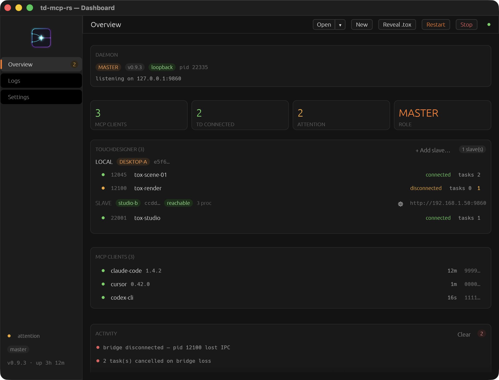
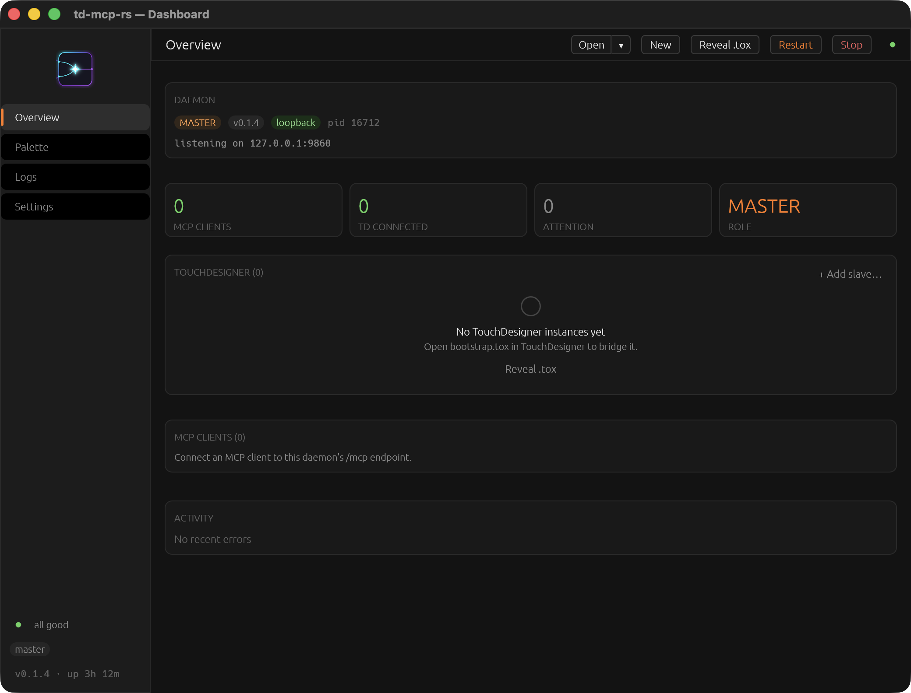
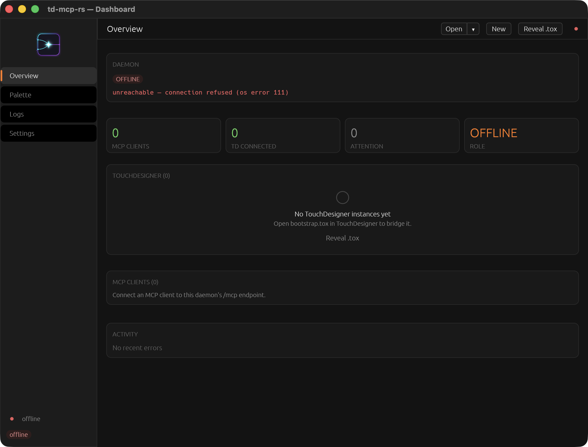
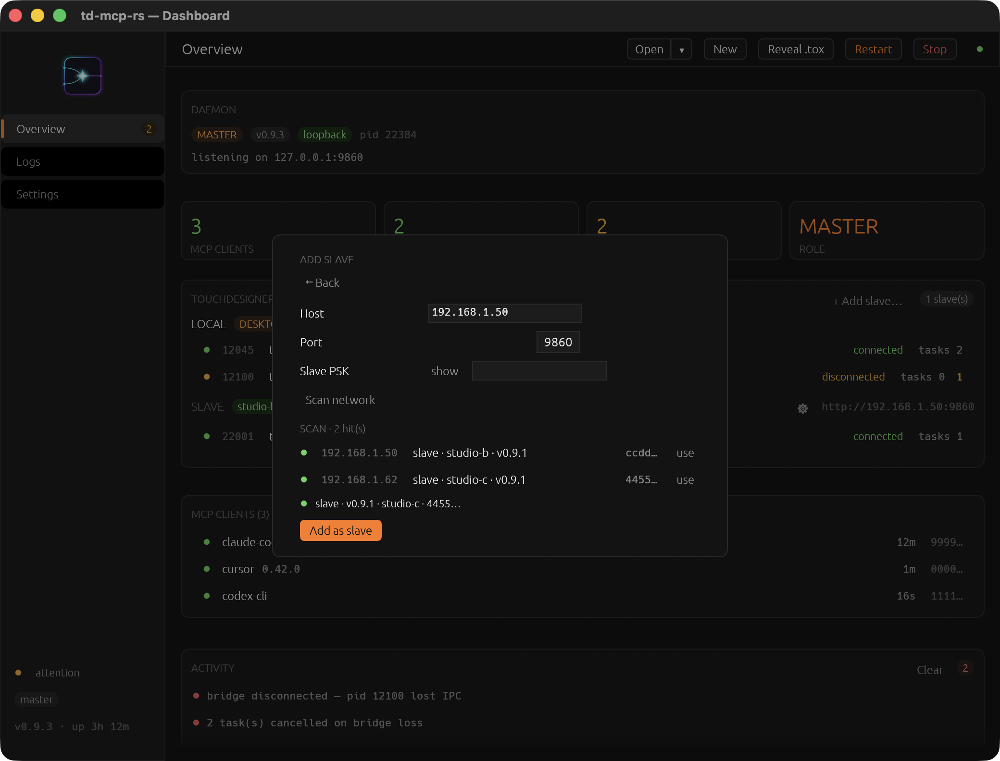
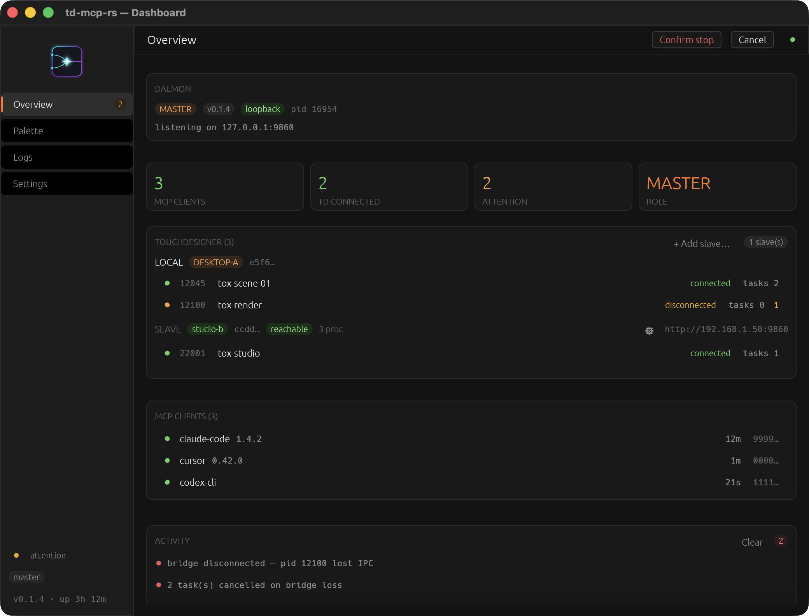
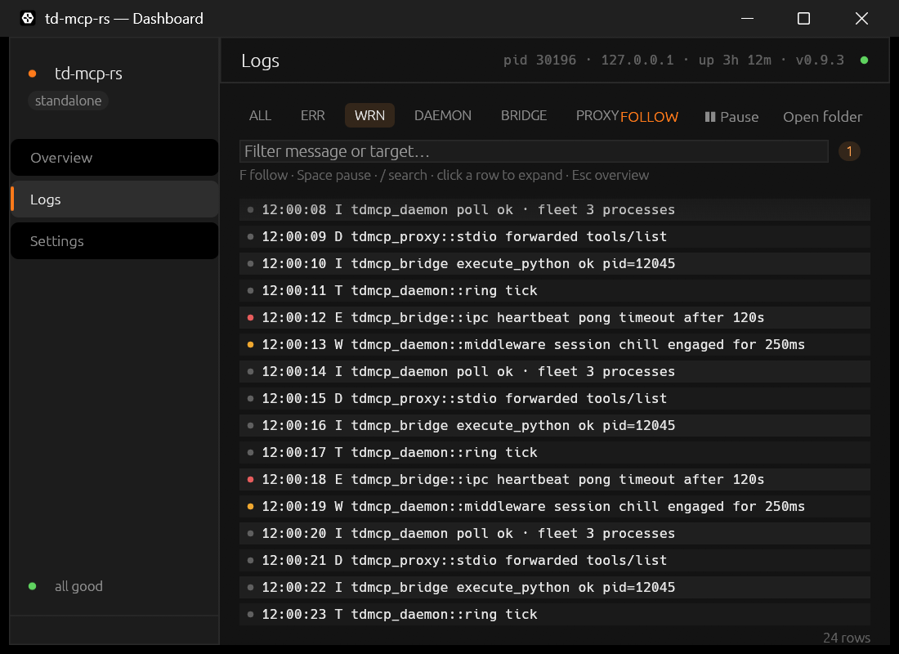
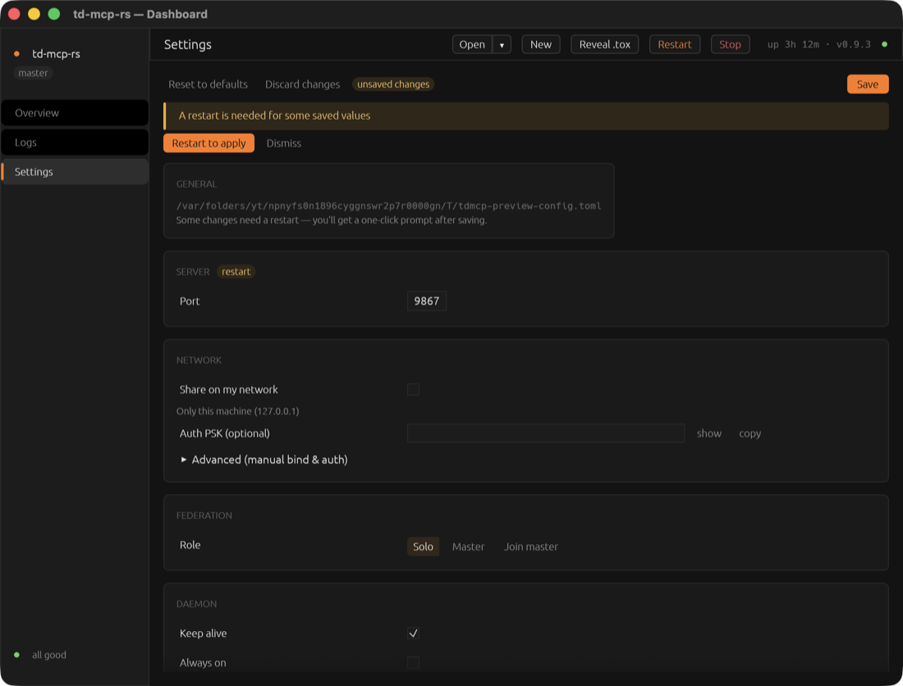

<div align="center">

# td-mcp-rs 🎛️

**Bring AI coding assistants into your TouchDesigner workflow — live, local, and in the editor you already use.**




[What is it?](#-what-is-td-mcp-rs) · [Screens](#-screens) · [What you can do](#-what-you-can-do-with-it) · [Quick Start](#-quick-start) · [Tools](#-what-you-can-ask-the-ai-to-do) · [Roadmap](#-roadmap) · [License](#-license)

</div>

---

## 🖼️ Screens

**Overview** — one page for everything: daemon health, your TouchDesigner
fleet grouped by machine, connected MCP clients, and recent activity.

<details>
<summary><b>More screens</b></summary>

| | |
| --- | --- |
|  |  |
| *Empty state — with one-click Reveal .tox* | *Offline — clear error, safe actions* |
|  |  |
| *Federation: add-slave with built-in network scan* | *Destructive actions get a two-step confirm* |
|  |  |
| *Logs — filters, search, follow/pause* | *Settings — honest Save gating + restart hints* |

</details>

---

## 💡 What is td-mcp-rs?

> An AI copilot for building TouchDesigner projects — right from your code editor.

td-mcp-rs connects AI coding assistants (Cursor, Claude Code, or any
MCP-compatible tool) to your **running** TouchDesigner. Instead of an AI
guessing how TouchDesigner works, it gets eyes and hands inside your project:
it can look at your network, edit operators, run Python, and see previews —
all over a local connection that never leaves your machine.

```
Your editor (Cursor, Claude Code, …)
        │  MCP over localhost
        ▼
td-mcp-rs (a small app running in your system tray)
        │  local connection
        ▼
Your TouchDesigner project (via the tdmcp_rs .tox you drop in)
```

---

## ✨ What you can do with it

| Feature | What it means for you |
| --- | --- |
| **Works with your editor** | Use Cursor, Claude Code, or any MCP-compatible assistant — they all share one connection |
| **Multiple projects at once** | Each running TouchDesigner is tracked by its own ID — keep several connected and jump between them |
| **Sees what you see** | The AI knows which network and operator you're looking at |
| **Teaches itself TouchDesigner** | A built-in skill pack (primers + references) is served to the assistant automatically |
| **Everything in one place** | One binary carries the bridge, catalog, bootstrap `.tox`, and skills — no extra installs |
| **Windows & macOS** | System-tray app with a rich dashboard window, headless if you prefer |
| **One place to see what's happening** | TD prints, bridge/proxy activity, and daemon internals all land in one rotating JSONL log — tail it with `tdmcp-daemon logs`, or watch it live on the dashboard's Logs tab |

---

## 🚀 Quick Start

> **Easiest install:** grab an installer from the
> [Releases page](https://github.com/Verbalize-public/td-mcp-rs/releases) —
> `tdmcp-rs-*-x64-setup.exe` on Windows or the `.dmg` for your Mac. No Rust
> needed; skip to step 3. *Unsigned builds:* Windows may show SmartScreen
> (*More info → Run anyway*); macOS: right-click → **Open** the first time, or
> allow it under System Settings ▸ Privacy & Security.

**You need:** [Rust](https://rustup.rs) (free, install once) and TouchDesigner.

### 1. Build the app

```text
cargo build --release -p tdmcp-daemon
```

Takes a few minutes the first time. The app lands in
`target/release/tdmcp-daemon` (`.exe` on Windows).

### 2. Install it

```text
# Windows
target\release\tdmcp-daemon.exe install

# macOS
target/release/tdmcp-daemon install
```

This copies the app to a permanent folder and prepares the TouchDesigner
bridge file for you. Run it once and forget it.

### 3. Add it to your editor

**Claude Code:**

```text
/plugin marketplace add Verbalize-public/td-mcp-rs
/plugin install td-mcp-rs@td-mcp-rs
```

You'll be prompted once for the path to your `tdmcp-daemon` binary (leave the
default if it's on `PATH`). This registers the MCP server *and* installs the
TouchDesigner operate skill — see [`docs/CLAUDE_CODE_PLUGIN.md`](docs/CLAUDE_CODE_PLUGIN.md).

**Cursor (or any other MCP-compatible editor):**

Copy this into your MCP settings (also in
[`mcp.tdmcp.example.json`](mcp.tdmcp.example.json)), replacing `<you>` with
your username:

```json
{
  "mcpServers": {
    "tdmcp-rs": {
      "command": "C:/Users/<you>/AppData/Local/tdmcp-rs/bin/tdmcp-daemon.exe",
      "args": ["mcp"]
    }
  }
}
```

### 4. Load the bridge into TouchDesigner

Drag `%LOCALAPPDATA%\tdmcp-rs\bootstrap.tox` into any project. A small
`tdmcp_rs` component appears and connects on its own — its color-coded status
face shows when the connection is live.

### 5. Say hello

In Cursor, type:

> Connect to my TouchDesigner and show me what's in my project.

You should see your project appear in the `fleet` view with a connected status.

<details>
<summary><b>Under the hood</b> — what's running, headless mode, other commands</summary>

- When your editor starts it (`tdmcp-daemon mcp`), the app makes sure the
  background service is up, then connects on port `9860`. The service keeps
  running in your system tray even if the editor closes.
- By default it stays resident (`keep_alive = true`); set `keep_alive = false`
  in `config.toml` (or tray Settings) to auto-exit after ~30s idle instead.
- **Tray:** left-click toggles a compact glance card near the tray;
  double-click opens the dashboard window; right-click opens a context menu
  (Dashboard · Stop · Restart). **Stop** also lives on the glance card footer
  and the dashboard's DAEMON card (or `tdmcp-daemon stop`) — closing windows
  only hides them.
- Headless: `tdmcp-daemon start --port 9860 --no-gui` or `TDMCP_NO_GUI=1`.

| Command | What it does |
| --- | --- |
| `install [--force]` | Set up assets + reset config to defaults |
| `ensure [--force]` | Start the background service if it's not running |
| `start [--port N]` | Run the service in the foreground |
| `status` | Check if the service is healthy |
| `stop` | Shut the service down |
| `mcp` | Editor entrypoint (what your editor spawns) |
| `skills path` / `skills render --dest <dir>` | Where the skill files live / export them |

</details>

---

## 🛠️ What you can ask the AI to do

Once connected, the AI has a small, focused toolbox:

| Tool | What it lets the AI do |
| --- | --- |
| `fleet` | See all your TouchDesigner instances and their connection status |
| `inspect` | Look inside any operator — parameters, errors, wiring |
| `execute_python` | Run Python code in TouchDesigner and get the result |
| `mutate_nodes` | Create, edit, delete, and connect operators |
| `capture` | Take a screenshot or preview of a network / TOP |
| `api_help` | Look up the TouchDesigner Python API while working |
| `editor_context` | See what you have selected in the editor |
| `describe_tools` | List what it can do right now |
| `td_installs` | Find every TouchDesigner install and whether it's usable |
| `project_unpack` / `project_pack` | Expand a `.toe`/`.tox` to editable files and pack it back |
| `project_lint` | Sanity-check a project (toc, external refs, bridge presence) |
| `project_install_bridge` | Install or refresh the MCP bridge inside any project file |
| `spawn_td` / `kill_td` | Start TouchDesigner on a project (deterministic pid) and close it |
| `dialogs` | See and dismiss TouchDesigner popups that block automation |

The AI can also read built-in TouchDesigner guides (OpSketch, Python
cheatsheet, primers, …) through the connection, so it doesn't have to guess —
or ask you to explain your setup.

<details>
<summary><b>Fine print</b> — caps and conventions for power users</summary>

- `inspect` takes a required `paths` array (soft-cap 256; no auto-recursion).
  Prefer `detailLevel: summary` — each node's child roster is `name` +
  `opType`, capped at 256 (`node.truncation` when truncated).
- Use `capture` when visual look is the claim; `preview` rasterizes any family
  via the bridge's shared OP Viewer TOP.
- Full contract: [`docs/CONTRACT.md`](docs/CONTRACT.md).

</details>

---

## 🗺️ Roadmap

**Shipped (v1 + v2 on Windows and macOS)**

- [x] Multiple TouchDesigner instances, addressed by OS `pid`
- [x] One shared service for multiple editors (survives editor restarts)
- [x] Reliable local connection — heartbeat + recovery of cancelled tasks
- [x] Agent-shaped tool set (`fleet` / `inspect` / `capture` + friends)
- [x] Self-contained delivery — one binary + one drop-in `.tox`
- [x] Built-in operate skills (served over MCP, or rendered to files)
- [x] Windows & macOS — tray dashboard / headless modes
- [x] `dialogs` — list / dismiss OS dialogs (CGWindowList + Accessibility on macOS)
- [x] Lifecycle — `spawn_td` / `kill_td` with deterministic pid ownership
- [x] Offline `.toe` / `.tox` editing via official toeexpand/toecollapse

**Planned**

- [ ] Remote / multi-machine master–slave control (reserved, not v1)

---

<details>
<summary><b>🧑‍💻 For developers</b> — tech stack, repo layout, docs, contributing</summary>

**Tech stack**

| Layer | Technology |
| --- | --- |
| Core | Rust (edition 2021, MSRV 1.92) — tokio, axum, rmcp |
| MCP | Streamable HTTP server + stdio proxy (rmcp) |
| IPC | TCP loopback (`127.0.0.1:9861`), framing + handshake, heartbeat + task queues |
| GUI | eframe / egui + tray-icon (system-tray dashboard, `gui` feature) |
| Config | TOML via `toml_edit` (`config.toml`) |
| Skills | Jinja templates (minijinja), embedded via `include_dir` |
| TD side | Embedded Python bridge package + drop-in `bootstrap.tox` |

**Repository layout**

```text
td-mcp-rs/
├── crates/
│   ├── tdmcp-core          # PidRegistry, shared types
│   ├── tdmcp-config        # config.toml load/save + Settings schema
│   ├── tdmcp-diagnostics   # rustc-style diagnostics + catalog.yaml
│   ├── tdmcp-ipc           # TCP loopback + framing + handshake
│   ├── tdmcp-mcp           # MCP server: tools, resources, stdio proxy
│   ├── tdmcp-projectio     # toeexpand/toecollapse, toc/sidecar
│   ├── tdmcp-dialogs       # OS dialogs (Win32 + macOS)
│   ├── tdmcp-daemon        # composition root: CLI, HTTP, tray
│   ├── tdmcp-gui           # egui dashboard (consumed via `gui` feature)
│   └── tdmcp-test-support  # shared test helpers
├── bridge/                 # Python package embedded into the daemon
├── skills/                 # Jinja skill templates + MANIFEST.yaml
├── claude-skills/          # Rendered skill pack for the Claude Code plugin (generated, checked in)
├── .claude-plugin/         # Claude Code plugin manifest
├── diagnostics/            # catalog.yaml
├── scripts/                # check.ps1 / check.sh quality gate
├── docs/                   # contract, config, delivery, testing, …
└── xtask/                  # packaging (cargo run -p xtask -- dist)
```

**Docs**

| Doc | Role |
| --- | --- |
| [`docs/CONTRACT.md`](docs/CONTRACT.md) | v1 contract — tools, OpPath, diagnostics, phases |
| [`docs/CONFIG.md`](docs/CONFIG.md) | `config.toml`, Settings GUI, `keep_alive` / `always_on` |
| [`docs/DELIVERY.md`](docs/DELIVERY.md) | Packaging / install / release tree |
| [`docs/TESTING.md`](docs/TESTING.md) | Test strategy |
| [`docs/E2E_CHECKLIST.md`](docs/E2E_CHECKLIST.md) | Live TouchDesigner verification |
| [`docs/DEV_ENV.md`](docs/DEV_ENV.md) | Interactive dual-MCP dev harness |
| [`docs/CLAUDE_CODE_PLUGIN.md`](docs/CLAUDE_CODE_PLUGIN.md) | Claude Code plugin — layout, `userConfig`, skill-render drift guard |
| [`ARCHITECTURE.md`](ARCHITECTURE.md) | Crate boundaries and topology |
| [`CONSTITUTION.md`](CONSTITUTION.md) | Rust engineering law (never-panic, lints) |
| [`RISKS.md`](RISKS.md) | Accepted panic/unsafe exceptions |
| [`AGENTS.md`](AGENTS.md) | Agent route-first entry |

**Contributing**

1. Fork the repo and create a feature branch (`feature/your-thing`).
2. Keep the quality gate green: `scripts/check.ps1` (Windows) or
   `scripts/check.sh` (Unix).
3. Read [`CONSTITUTION.md`](CONSTITUTION.md) before touching Rust code —
   never-panic is enforced: `unwrap_used`, `expect_used`, and `panic` are
   deny-by-default lints.
4. Open a PR against `main` and say what you verified (tests + live TD where
   it applies).

</details>

---

## 📄 License

MIT — declared in [`Cargo.toml`](Cargo.toml).

